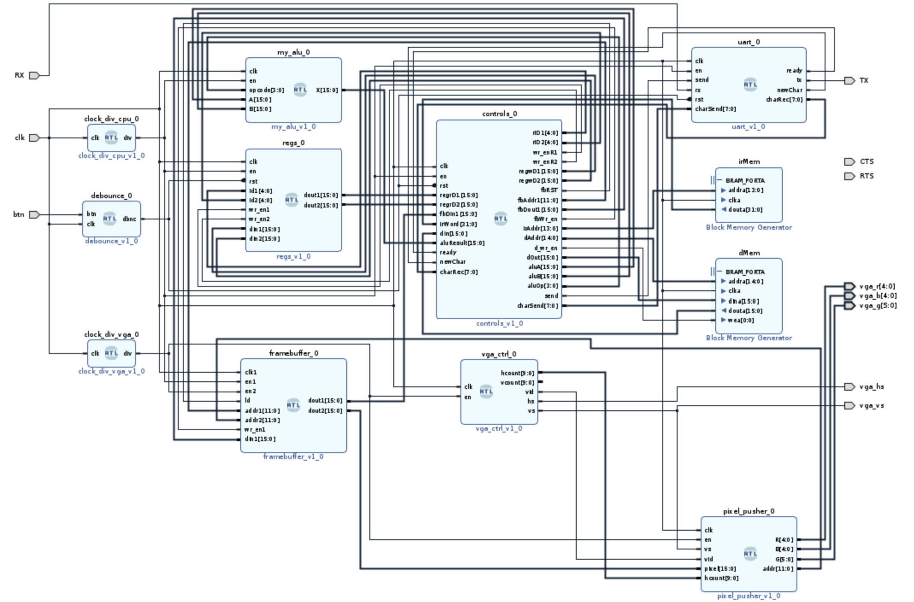
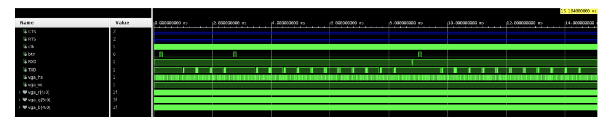
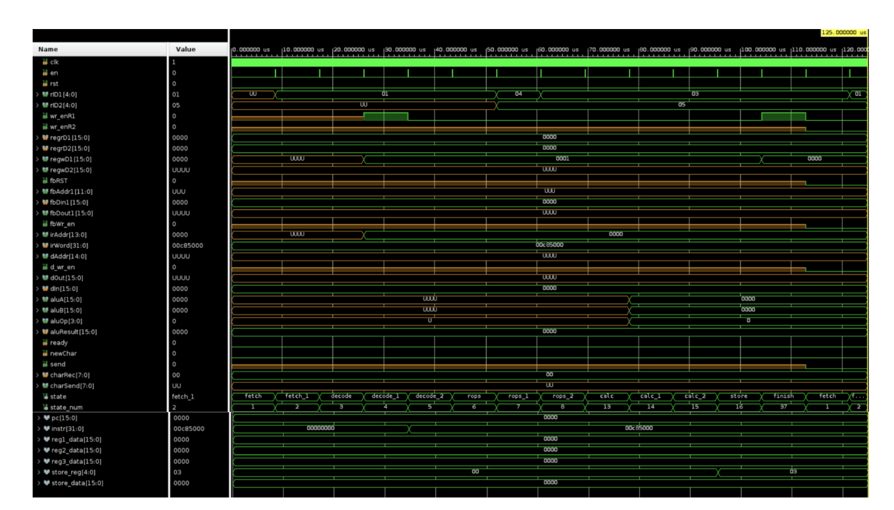

# ⚙️ FPGA ASIP - Application-Specific Instruction-Set Processor

> A custom 16-bit processor implemented from scratch in VHDL on an FPGA, featuring VGA graphics output, UART serial communication, and a complete toolchain including assembler and software simulator.

<p align="center">
  
</p>

## 📖 Overview

This project implements a full **Application-Specific Instruction-Set Processor (ASIP)** on an FPGA development board. It features a custom 16-bit GRISC instruction set architecture with 32 general-purpose registers, a multi-cycle control unit with a 39-state finite state machine, and dedicated I/O peripherals including VGA output and UART serial communication.

The system bridges the gap between software and hardware: assembly programs are written in a custom ISA, assembled into binary COE files via a Python assembler, and then executed directly on custom VHDL hardware.

### ✨ Key Features

- 🖥️ **Custom 16-bit Processor** - Full CPU with register file, ALU, control unit, and memory interfaces
- 🎨 **VGA Graphics Output** - 64x64 resolution framebuffer rendered to a standard VGA monitor (640x480 @ 60Hz)
- 📡 **UART Serial Communication** - Send and receive characters over serial端口
- ⚡ **Multi-Cycle Control Unit** - 39-state FSM implementing fetch-decode-execute cycles
- 🔧 **Python Assembler** - Converts custom assembly to Xilinx COE memory initialization files
- 🧪 **Software Simulator** - Python-based simulator with interactive debugger, breakpoints, and framebuffer preview
- 📝 **Custom GRISC ISA** - 23 instructions across R-type, I-type, and J-type formats

## 🏗️ Architecture

<p align="center">
  
</p>

### System Components

| Module | Description |
|--------|-------------|
| [`top.vhd`](src/top.vhd) | Top-level entity connecting all modules |
| [`controls.vhd`](src/controls.vhd) | Control unit - 39-state FSM managing instruction execution |
| [`my_alu.vhd`](src/my_alu.vhd) | Arithmetic Logic Unit supporting 16 operations |
| [`regs.vhd`](src/regs.vhd) | 32x16-bit register file with dual read, dual write |
| [`framebuffer.vhd`](src/framebuffer.vhd) | Dual-port 4096x16-bit framebuffer memory (CPU + VGA) |
| [`dmem.vhd`](src/dmem.vhd) | 32Kx16-bit data memory |
| [`irmem.vhd`](src/irmem.vhd) | 16Kx32-bit instruction memory |
| [`vga_ctrl.vhd`](src/vga_ctrl.vhd) | VGA timing controller (640x480 @ 60Hz) |
| [`pixel_pusher.vhd`](src/pixel_pusher.vhd) | VGA pixel output driver (64x64 visible region) |
| [`uart.vhd`](src/uart.vhd) | UART top-level (TX + RX) |
| [`uart_tx.vhd`](src/uart_tx.vhd) | UART transmitter |
| [`uart_rx.vhd`](src/uart_rx.vhd) | UART receiver |
| [`clock_div_cpu.vhd`](src/clock_div_cpu.vhd) | Clock divider for CPU (~10.8 kHz from 100MHz) |
| [`clock_div_vga.vhd`](src/clock_div_vga.vhd) | Clock divider for VGA (25 MHz from 125 MHz) |
| [`debounce.vhd`](src/debounce.vhd) | Button debouncer with shift register |

## 📊 Simulation & Verification

### Top-Level Waveforms

The waveform below shows the full system executing instructions, with the control unit driving the register file, ALU, and memory interfaces:

<p align="center">
  
</p>

### Control Unit State Machine

This waveform captures the control unit's 39-state FSM transitioning through fetch, decode, and execute phases:

<p align="center">
  
</p>

## 🧠 The GRISC Instruction Set Architecture

The processor implements a custom **GRISC ISA** with 23 instructions across three formats:

### Instruction Formats

| Type       | Format                                                  | Description                       |
| ---------- | ------------------------------------------------------- | --------------------------------- |
| **R-type** | `00/01` `opcode(5)` `r1(5)` `r2(5)` `r3(5)` `unused(7)` | Register-to-register operations   |
| **I-type** | `10` `opcode(5)` `r1(5)` `r2(5)` `immediate(16)`        | Immediate operations and branches |
| **J-type** | `11` `opcode(5)` `address(26)`                          | Jump operations                   |

### Instruction Listing

| Opcode  | Mnemonic | Type | Description                                        |
| ------- | -------- | ---- | -------------------------------------------------- |
| `00000` | `add`    | R    | `r1 = r2 + r3`                                     |
| `00001` | `sub`    | R    | `r1 = r2 - r3`                                     |
| `00010` | `sll`    | R    | `r1 = r2 << 1`                                     |
| `00011` | `srl`    | R    | `r1 = r2 >> 1` (logical)                           |
| `00100` | `sra`    | R    | `r1 = r2 >>> 1` (arithmetic)                       |
| `00101` | `and`    | R    | `r1 = r2 & r3`                                     |
| `00110` | `or`     | R    | `r1 = r2                                           | r3`        |
| `00111` | `xor`    | R    | `r1 = r2 ^ r3`                                     |
| `01000` | `slt`    | R    | `r1 = (r2 < r3)` signed                            |
| `01001` | `sgt`    | R    | `r1 = (r2 > r3)` signed                            |
| `01010` | `seq`    | R    | `r1 = (r2 == r3)`                                  |
| `01011` | `send`   | R    | UART send character from `r1`                      |
| `01100` | `recv`   | R    | UART receive character into `r1`                   |
| `01101` | `jr`     | R    | Jump to address in `r1`                            |
| `01110` | `wpix`   | R    | Write `r2` pixel to framebuffer address `r1`       |
| `01111` | `rpix`   | R    | Read pixel from framebuffer address `r2` into `r1` |
| `10000` | `beq`    | I    | Branch if `r1 == r2` to label                      |
| `10001` | `bne`    | I    | Branch if `r1 != r2` to label                      |
| `10010` | `ori`    | I    | `r1 = r2                                           | immediate` |
| `10011` | `lw`     | I    | `r1 = mem[r2 + label]`                             |
| `10100` | `sw`     | I    | `mem[r2 + label] = r1`                             |
| `11000` | `j`      | J    | Jump to label                                      |
| `11001` | `jal`    | J    | Jump to label, save return address to `$ra`        |
| `11010` | `clrscr` | J    | Clear framebuffer (set all pixels to 0)            |

### Registers

| Register       | ID                | Purpose                   |
| -------------- | ----------------- | ------------------------- |
| `$zero`        | `00000`           | Hardwired to zero         |
| `$pc`          | `00001`           | Program counter           |
| `$ra`          | `00010`           | Return address            |
| `$r3` - `$r31` | `00011` - `11111` | General-purpose registers |

## 🔧 Python Toolchain

### Assembler

The [`assembler.py`](src/assembler.py) (written by **Gregory Leonberg**) converts custom assembly source files into Xilinx COE (Coefficient) memory initialization files:

```bash
cd src
python assembler.py
```

**Input:** `asm/hello_world.txt`
```asm
.data
val1: str "hello_world"

.text
ori $r3 $zero 0
ori $r4 $zero 0
lw $r7 $r3 val1
send $r7
add $r3 $r3 $r5
j beg
```

**Output:** `asm/data.coe` and `asm/text.coe`

The assembler also automatically updates the VHDL memory initialization arrays in `dmem.vhd` and `irmem.vhd`.

### Simulator

The [`simulator.py`](src/simulator.py) (written by **Gregory Leonberg**) provides a full software simulation of the processor with an interactive debug shell:

```bash
cd src
python simulator.py
```

**Debug Shell Commands:**

| Command                     | Description                 |
| --------------------------- | --------------------------- |
| `prg`                       | Show parsed program         |
| `dlabels` / `tlabels`       | Show data/text labels       |
| `instr`                     | Show current instruction    |
| `regs`                      | Display all register values |
| `bps`                       | Show breakpoints            |
| `addbp` / `rmbp`            | Add/remove breakpoint       |
| `step`                      | Execute single instruction  |
| `vPeek` / `dPeek`           | Peek at video/data memory   |
| `vPoke` / `dPoke` / `rPoke` | Poke memory/register values |
| `help`                      | Show command list           |
| `exit`                      | Resume execution            |

The simulator spawns a background thread that renders the 64x64 framebuffer to an image window in real-time.

## 🔌 Hardware Setup

### Required Hardware

| Component       | Details                                                    |
| --------------- | ---------------------------------------------------------- |
| **FPGA Board**  | Digilent Zybo Z7 (Zynq-7000) or equivalent with VGA output |
| **VGA Monitor** | Standard VGA display supporting 640x480 resolution         |
| **VGA Cable**   | To connect FPGA to monitor                                 |
| **USB-UART**    | Serial terminal connection (e.g., PuTTY, Tera Term)        |

### Pin Connections

| Signal       | Direction | Description               |
| ------------ | --------- | ------------------------- |
| `vga_r[4:0]` | Output    | 5-bit Red color channel   |
| `vga_g[5:0]` | Output    | 6-bit Green color channel |
| `vga_b[4:0]` | Output    | 5-bit Blue color channel  |
| `vga_hs`     | Output    | Horizontal sync           |
| `vga_vs`     | Output    | Vertical sync             |
| `RXD`        | Input     | UART receive              |
| `TXD`        | Output    | UART transmit             |
| `btn`        | Input     | Reset button (debounced)  |
| `clk`        | Input     | System clock (100 MHz)    |

### VGA Output

The VGA output displays a **64x64 pixel region** centered on a 640x480 screen. Each pixel is 16-bit color:
- **Red:** 5 bits (`pixel[15:11]`)
- **Green:** 6 bits (`pixel[10:5]`)
- **Blue:** 5 bits (`pixel[4:0]`)

The framebuffer is a 4096-entry memory, addressed as `row + col*64`.

## 🚀 Getting Started

### Prerequisites

- Vivado (Xilinx FPGA design software) or equivalent VHDL toolchain
- Python 3 with `Pillow` and `numpy` (for simulator)
- FPGA development board with VGA output
- USB-UART interface

### Build & Deploy

1. **Clone the repository**
   ```bash
   git clone https://github.com/RonikKapadia/embedded-fpga-asip.git
   cd embedded-fpga-asip
   ```

2. **Write or modify assembly code**
   - Edit `src/asm/hello_world.txt` or create a new `.txt` file

3. **Assemble the program**
   ```bash
   cd src
   python assembler.py
   ```
   This generates `data.coe` and `text.coe`, and updates VHDL memory files.

4. **Open in Vivado**
   - Create a new project targeting your FPGA board
   - Add all `.vhd` files from the `src/` directory
   - Add [`constraints.xdc`](src/constraints.xdc)
   - Set `top.vhd` as the top-level entity

5. **Configure Pin Assignments**
   The included [`constraints.xdc`](src/constraints.xdc) already maps pins for the **Digilent Zybo Z7**:

   | Signal | Pin | I/O Standard |
   |--------|-----|--------------|
   | `clk` | L16 | LVCMOS33 |
   | `btn` | R18 | LVCMOS33 |
   | `RXD` | K16 | LVCMOS33 (PMOD JA) |
   | `TXD` | L14 | LVCMOS33 (PMOD JA) |
   | `RTS` | N15 | LVCMOS33 (PMOD JA) |
   | `CTS` | K14 | LVCMOS33 (PMOD JA) |
   | `vga_r[0]` | M19 | LVCMOS33 |
   | `vga_r[1]` | L20 | LVCMOS33 |
   | `vga_r[2]` | J20 | LVCMOS33 |
   | `vga_r[3]` | G20 | LVCMOS33 |
   | `vga_r[4]` | F19 | LVCMOS33 |
   | `vga_g[0]` | H18 | LVCMOS33 |
   | `vga_g[1]` | N20 | LVCMOS33 |
   | `vga_g[2]` | L19 | LVCMOS33 |
   | `vga_g[3]` | J19 | LVCMOS33 |
   | `vga_g[4]` | H20 | LVCMOS33 |
   | `vga_g[5]` | F20 | LVCMOS33 |
   | `vga_b[0]` | P20 | LVCMOS33 |
   | `vga_b[1]` | M20 | LVCMOS33 |
   | `vga_b[2]` | K19 | LVCMOS33 |
   | `vga_b[3]` | J18 | LVCMOS33 |
   | `vga_b[4]` | G19 | LVCMOS33 |
   | `vga_hs` | P19 | LVCMOS33 |
   | `vga_vs` | R19 | LVCMOS33 |

   - Clock constraint is set to **125 MHz** (`-period 8.00`)
   - Adjust the constraint file if using a different board

6. **Compile & Program**
   - Run Synthesis
   - Run Implementation
   - Generate bitstream
   - Program the FPGA

7. **Connect & Test!**
   - Connect VGA cable to monitor
   - Open a serial terminal (115200 baud, 8N1)
   - Power on and watch the program execute!

### Running the Simulator

```bash
cd src
python simulator.py
```

Follow the prompts to set breakpoints, then use the debug shell to step through and inspect the processor state.

## 📁 Project Structure

```
embedded-fpga-asip/
├── 📂 assets/
│   ├── TopBlockDesign.png      # Top-level block diagram
│   ├── top_waveforms.png       # Top-level simulation waveforms
│   └── controls_waveform.png   # Control unit FSM waveform
├── 📂 src/
│   ├── 📂 asm/
│   │   ├── hello_world.txt     # Sample assembly program
│   │   ├── data.coe            # Assembled data memory
│   │   └── text.coe            # Assembled instruction memory
│   ├── top.vhd                 # Top-level module
│   ├── controls.vhd            # Control unit (39-state FSM)
│   ├── my_alu.vhd              # Arithmetic Logic Unit
│   ├── regs.vhd                # Register file
│   ├── framebuffer.vhd         # Dual-port framebuffer
│   ├── dmem.vhd                # Data memory
│   ├── irmem.vhd               # Instruction memory
│   ├── vga_ctrl.vhd            # VGA timing controller
│   ├── pixel_pusher.vhd        # VGA pixel output driver
│   ├── uart.vhd                # UART top-level
│   ├── uart_tx.vhd             # UART transmitter
│   ├── uart_rx.vhd             # UART receiver
│   ├── clock_div_cpu.vhd       # CPU clock divider
│   ├── clock_div_vga.vhd       # VGA clock divider
│   ├── debounce.vhd            # Button debouncer
│   ├── constraints.xdc         # Zybo Z7 pin constraints
│   ├── assembler.py            # Python assembler
│   ├── simulator.py            # Python simulator + debugger
│   ├── make.bat                # Build script
│   ├── check.bat               # Simulation/check script
│   └── view.bat                # Waveform viewer script
└── README.md                   # This file!
```

## 🧠 Technical Highlights

### Multi-Cycle Control Unit

The control unit implements a **39-state finite state machine** that orchestrates every phase of instruction execution:

```vhdl
type state_type is (
    fetch, fetch_1, decode, decode_1, decode_2,
    rops, rops_1, rops_2, lops, lops_1,
    jops, jops_1, calc, calc_1, calc_2,
    store, jr, recv, rpix, rpix_1, rpix_2,
    wpix, sen, equals, nequals, ori,
    lw, lw_1, lw_2, lw_3, sw, sw_1, sw_2,
    jmp, jal, clrscr, finish, reset, reset_1
);
```

States include:
- **Fetch:** Read program counter from register `$pc`
- **Decode:** Read instruction from memory, increment PC
- **Execute:** Route to R-type, I-type, or J-type execution paths
- **Memory:** Handle load/store and framebuffer operations
- **Writeback:** Store results to register file

### Dual-Clock Domain Design

The system uses two independent clock domains:
- **CPU clock** (~10.8 kHz) - Sufficient for instruction execution
- **VGA clock** (25 MHz) - Required for 640x480 @ 60Hz timing

The **framebuffer** acts as a dual-port bridge between domains:
- Port 1: CPU read/write at CPU clock rate
- Port 2: VGA read-only at VGA clock rate

### ALU Operations

The ALU supports 16 distinct operations controlled by a 4-bit opcode:

```vhdl
if    opcode = x"0" then X <= A + B;       -- add
elsif opcode = x"1" then X <= A - B;       -- sub
elsif opcode = x"5" then X <= A sll 1;     -- sll
elsif opcode = x"8" then X <= A and B;     -- and
elsif opcode = x"B" then X <= (A < B);     -- slt
elsif opcode = x"D" then X <= (A = B);     -- seq
-- ... and more
```

## 📝 Sample Program

[`hello_world.txt`](src/asm/hello_world.txt) demonstrates core features:

```asm
.data
val1: str "hello_world"

.text
// load constants
ori $r3 $zero 0       // string counter
ori $r4 $zero 0       // video memory counter
ori $r5 $zero 1       // constant 1
ori $r6 $zero 4096    // video memory max

// print string via UART
beg:
lw $r7 $r3 val1
beq $r7 $zero wait
send $r7
add $r3 $r3 $r5
j beg

// wait for UART input
wait:
recv $r8

// display pixels on VGA
disp:
beq $r4 $r6 wait
wpix $r4 $r8
add $r4 $r4 $r5
j disp
```

This program:
1. Loads a string from data memory
2. Sends each character over UART
3. Waits to receive a character back
4. Fills the VGA framebuffer with received pixel data

## 📄 License

This project is open-source and available for educational purposes. Feel free to fork, modify, and build upon it!

## 🙏 Credits & Acknowledgments

- **Assembler & Simulator** written by Gregory Leonberg
- **UART Module** written by Gregory Leonberg
- **Architecture Design** inspired by MIPS-style RISC processors
